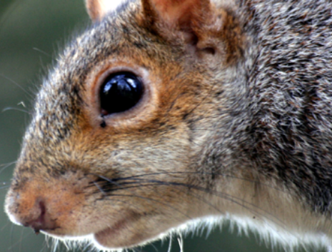
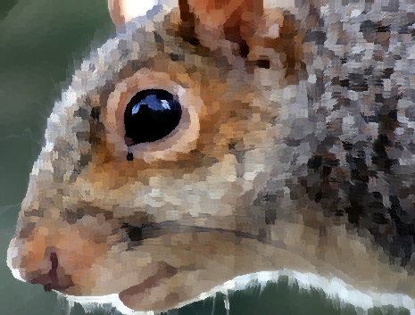
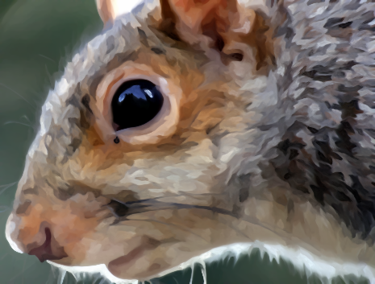

# Kuwahara Filter

The [Kuwahara filter](https://en.wikipedia.org/wiki/Kuwahara_filter) is an image-processing technique for reducing noise whilst preserving edges. One of the interesting consequences of this algorithm is will generate "brush-stroke" like artifacts, which can acts as a painterly filter on the image.


## Examples
This project contains two implementations of the Kuwahara filter: The [Basic](https://link.springer.com/chapter/10.1007/978-1-4684-0769-3_13) and [Anisotropic](https://www.researchgate.net/publication/220507613_Image_and_Video_Abstraction_by_Anisotropic_Kuwahara_Filtering) version. The advantage of the anisotropic version ins that it takes into account the "angle" of each region, and generates brush-strokes to suit, which generates longer and smoother strokes compared to the basic version.

||
:------------------------------:|:--------------------------------:|:--------------------:
Original                        | Basic                            | Anisotropic


## Usage

### Basic

```sh
./kuwahara basic --input ./example.png --kernel-size 5
```

The `--kernel-size` flag determines how big the "brush strokes" will be. You can also modify the output directory and filename with `--output` and `--output-dir`.

### Anisotropic

```sh
./kuwahara anisotropic --input ./example.png 
```

Optionally, you can add `--intermediate-results` to see some of the intermediate calculations required to generate the final image.